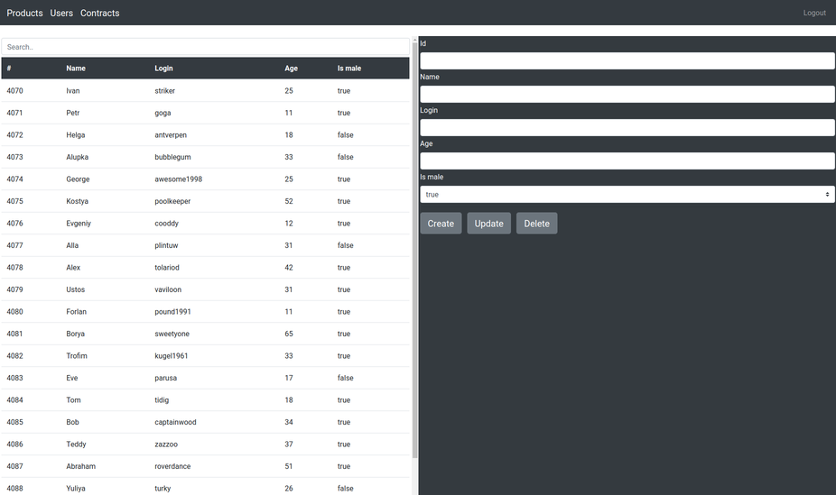
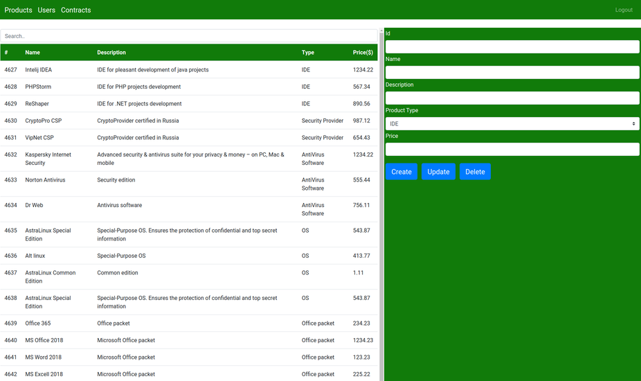
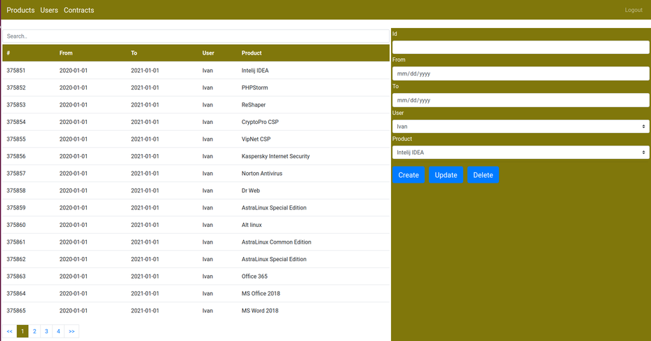

# Demo Web project

## General info

This is a demo project. Its basis is created with 

* [Spring Initializr](https://start.spring.io/) 

Main purpose of this [demo](https://github.com/shaprj/demo-web) is to demonstrate ability to work with spring-boot teсhnologies.

Below it is a complete tech stack for this demo:

* [Spring Boot](https://spring.io/projects/spring-boot)
* [Spring Web MVC](https://docs.spring.io/spring/docs/current/spring-framework-reference/web.html)
* [Spring Security](https://spring.io/projects/spring-security)
* [Spring Data JPA](https://spring.io/projects/spring-data-jpa)
* [Thymeleaf](https://www.thymeleaf.org/)
* HTML5/Bootstrap/CSS/JS

The application consists of 3 forms:
* Users dictionary management form
    
* Products dictionary management form
    
* Contracts operative management from
    
    
All forms are prefilled with test data while app is loading

Contracts data is filled for all users & products for the period untill 2051 year.

So data scale in Contracts form is enough to make the direct work in browser unbearable.

That is why the logic of this from is changed. 

All data operatoions are processed on the backend part & pagination is used.

## Security

The basic auth is used.

Added the only in-memmory user with role "USER" which approve all form access

The credentails are: user/password

## Build & Deploy

Project is build with maven & deployed with embedded tomcat container.

So: "mvn clean package" & go on.

The project use [PostgreSql](https://www.postgresql.org/) for data storage & management

So create manually an empty scheme after installation.

All connection data are located in application.properties config file.

